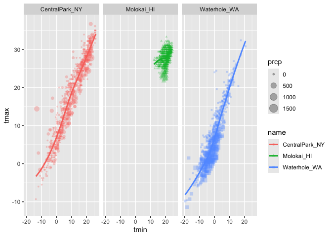
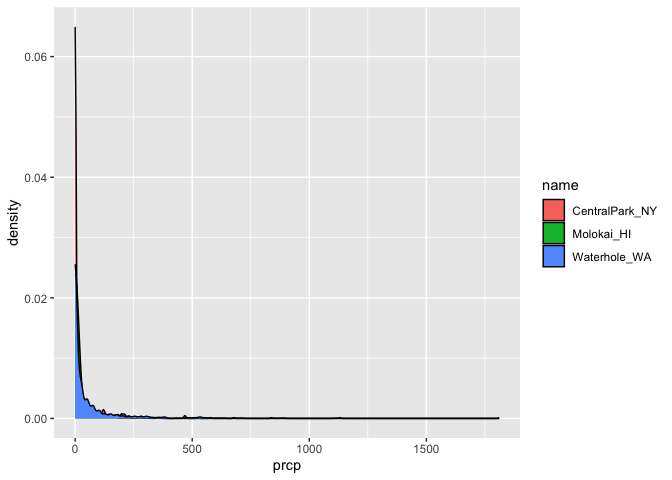
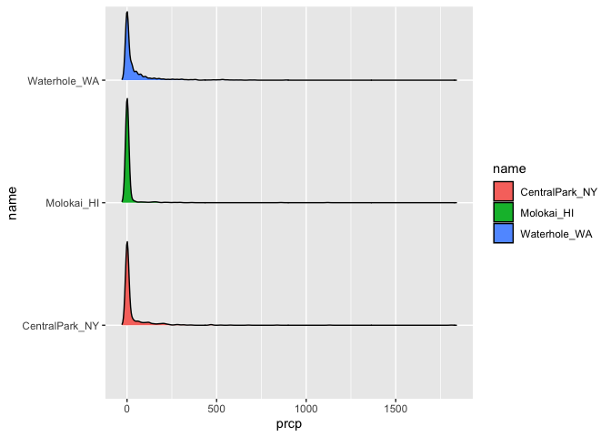

Viz_and_eda
================
2025-09-26

Import the weather data.

``` r
data("weather_df")
```

Making our first plot

``` r
ggplot(data=weather_df, mapping=aes(x=tmin,y=tmax)) +
  geom_point()
```

    ## Warning: Removed 17 rows containing missing values or values outside the scale range
    ## (`geom_point()`).

<!-- -->

Another way to do it is through the pipe function

``` r
weather_df %>% 
  ggplot(aes(x=tmin,y=tmax)) +
  geom_point()
```

    ## Warning: Removed 17 rows containing missing values or values outside the scale range
    ## (`geom_point()`).

<!-- -->

``` r
ggp_weather_scatterplot=
  weather_df %>% 
  ggplot(aes(x=tmin,y=tmax)) +
  geom_point()
ggp_weather_scatterplot
```

    ## Warning: Removed 17 rows containing missing values or values outside the scale range
    ## (`geom_point()`).

<!-- -->

Check that some rows are missing.

``` r
weather_df %>% 
  filter(is.na(tmax))
```

    ## # A tibble: 17 × 6
    ##    name         id          date        prcp  tmax  tmin
    ##    <chr>        <chr>       <date>     <dbl> <dbl> <dbl>
    ##  1 Molokai_HI   USW00022534 2022-05-31    NA    NA    NA
    ##  2 Waterhole_WA USS0023B17S 2021-03-09    NA    NA    NA
    ##  3 Waterhole_WA USS0023B17S 2021-12-07    51    NA    NA
    ##  4 Waterhole_WA USS0023B17S 2021-12-31     0    NA    NA
    ##  5 Waterhole_WA USS0023B17S 2022-02-03     0    NA    NA
    ##  6 Waterhole_WA USS0023B17S 2022-08-09    NA    NA    NA
    ##  7 Waterhole_WA USS0023B17S 2022-08-10    NA    NA    NA
    ##  8 Waterhole_WA USS0023B17S 2022-08-11    NA    NA    NA
    ##  9 Waterhole_WA USS0023B17S 2022-08-12    NA    NA    NA
    ## 10 Waterhole_WA USS0023B17S 2022-08-13    NA    NA    NA
    ## 11 Waterhole_WA USS0023B17S 2022-08-14    NA    NA    NA
    ## 12 Waterhole_WA USS0023B17S 2022-08-15    NA    NA    NA
    ## 13 Waterhole_WA USS0023B17S 2022-08-16    NA    NA    NA
    ## 14 Waterhole_WA USS0023B17S 2022-08-17    NA    NA    NA
    ## 15 Waterhole_WA USS0023B17S 2022-08-18    NA    NA    NA
    ## 16 Waterhole_WA USS0023B17S 2022-08-19    NA    NA    NA
    ## 17 Waterhole_WA USS0023B17S 2022-12-31    76    NA    NA

## Fancier scatterplotes !

Note that aes is for mapping the points alpha sets the opacity

``` r
weather_df %>% 
  ggplot(aes(x=tmin,y=tmax,color=name)) + 
  geom_point(alpha=0.3)+
  geom_smooth(se=FALSE)
```

    ## `geom_smooth()` using method = 'loess' and formula = 'y ~ x'

    ## Warning: Removed 17 rows containing non-finite outside the scale range
    ## (`stat_smooth()`).

    ## Warning: Removed 17 rows containing missing values or values outside the scale range
    ## (`geom_point()`).

<!-- -->

``` r
weather_df
```

    ## # A tibble: 2,190 × 6
    ##    name           id          date        prcp  tmax  tmin
    ##    <chr>          <chr>       <date>     <dbl> <dbl> <dbl>
    ##  1 CentralPark_NY USW00094728 2021-01-01   157   4.4   0.6
    ##  2 CentralPark_NY USW00094728 2021-01-02    13  10.6   2.2
    ##  3 CentralPark_NY USW00094728 2021-01-03    56   3.3   1.1
    ##  4 CentralPark_NY USW00094728 2021-01-04     5   6.1   1.7
    ##  5 CentralPark_NY USW00094728 2021-01-05     0   5.6   2.2
    ##  6 CentralPark_NY USW00094728 2021-01-06     0   5     1.1
    ##  7 CentralPark_NY USW00094728 2021-01-07     0   5    -1  
    ##  8 CentralPark_NY USW00094728 2021-01-08     0   2.8  -2.7
    ##  9 CentralPark_NY USW00094728 2021-01-09     0   2.8  -4.3
    ## 10 CentralPark_NY USW00094728 2021-01-10     0   5    -1.6
    ## # ℹ 2,180 more rows

Where you define aesthetics can matter

``` r
weather_df %>% 
  ggplot(aes(x=tmin,y=tmax)) + 
  geom_point(aes(color=name, size=prcp),alpha=0.3)+
  geom_smooth(se=FALSE)
```

    ## `geom_smooth()` using method = 'gam' and formula = 'y ~ s(x, bs = "cs")'

    ## Warning: Removed 17 rows containing non-finite outside the scale range
    ## (`stat_smooth()`).

    ## Warning: Removed 19 rows containing missing values or values outside the scale range
    ## (`geom_point()`).

<!-- -->

``` r
weather_df
```

    ## # A tibble: 2,190 × 6
    ##    name           id          date        prcp  tmax  tmin
    ##    <chr>          <chr>       <date>     <dbl> <dbl> <dbl>
    ##  1 CentralPark_NY USW00094728 2021-01-01   157   4.4   0.6
    ##  2 CentralPark_NY USW00094728 2021-01-02    13  10.6   2.2
    ##  3 CentralPark_NY USW00094728 2021-01-03    56   3.3   1.1
    ##  4 CentralPark_NY USW00094728 2021-01-04     5   6.1   1.7
    ##  5 CentralPark_NY USW00094728 2021-01-05     0   5.6   2.2
    ##  6 CentralPark_NY USW00094728 2021-01-06     0   5     1.1
    ##  7 CentralPark_NY USW00094728 2021-01-07     0   5    -1  
    ##  8 CentralPark_NY USW00094728 2021-01-08     0   2.8  -2.7
    ##  9 CentralPark_NY USW00094728 2021-01-09     0   2.8  -4.3
    ## 10 CentralPark_NY USW00094728 2021-01-10     0   5    -1.6
    ## # ℹ 2,180 more rows

Use facetting real quick: works by making multiple plots in a row to
column framework

``` r
weather_df %>% 
  ggplot(aes(x=tmin,y=tmax)) + 
  geom_point(aes(color=name),alpha=0.3,size=0.3)+
  geom_smooth(se=FALSE)+
  facet_grid(.~name)
```

    ## `geom_smooth()` using method = 'loess' and formula = 'y ~ x'

    ## Warning: Removed 17 rows containing non-finite outside the scale range
    ## (`stat_smooth()`).

    ## Warning: Removed 17 rows containing missing values or values outside the scale range
    ## (`geom_point()`).

<!-- -->

``` r
weather_df
```

    ## # A tibble: 2,190 × 6
    ##    name           id          date        prcp  tmax  tmin
    ##    <chr>          <chr>       <date>     <dbl> <dbl> <dbl>
    ##  1 CentralPark_NY USW00094728 2021-01-01   157   4.4   0.6
    ##  2 CentralPark_NY USW00094728 2021-01-02    13  10.6   2.2
    ##  3 CentralPark_NY USW00094728 2021-01-03    56   3.3   1.1
    ##  4 CentralPark_NY USW00094728 2021-01-04     5   6.1   1.7
    ##  5 CentralPark_NY USW00094728 2021-01-05     0   5.6   2.2
    ##  6 CentralPark_NY USW00094728 2021-01-06     0   5     1.1
    ##  7 CentralPark_NY USW00094728 2021-01-07     0   5    -1  
    ##  8 CentralPark_NY USW00094728 2021-01-08     0   2.8  -2.7
    ##  9 CentralPark_NY USW00094728 2021-01-09     0   2.8  -4.3
    ## 10 CentralPark_NY USW00094728 2021-01-10     0   5    -1.6
    ## # ℹ 2,180 more rows

``` r
weather_df %>% 
  ggplot(aes(x=tmin,y=tmax)) + 
  geom_point(aes(color=name),alpha=0.3,size=0.3)+
  geom_smooth(se=FALSE)+
  facet_grid(name~.)
```

    ## `geom_smooth()` using method = 'loess' and formula = 'y ~ x'

    ## Warning: Removed 17 rows containing non-finite outside the scale range
    ## (`stat_smooth()`).
    ## Removed 17 rows containing missing values or values outside the scale range
    ## (`geom_point()`).

<!-- -->

``` r
weather_df
```

    ## # A tibble: 2,190 × 6
    ##    name           id          date        prcp  tmax  tmin
    ##    <chr>          <chr>       <date>     <dbl> <dbl> <dbl>
    ##  1 CentralPark_NY USW00094728 2021-01-01   157   4.4   0.6
    ##  2 CentralPark_NY USW00094728 2021-01-02    13  10.6   2.2
    ##  3 CentralPark_NY USW00094728 2021-01-03    56   3.3   1.1
    ##  4 CentralPark_NY USW00094728 2021-01-04     5   6.1   1.7
    ##  5 CentralPark_NY USW00094728 2021-01-05     0   5.6   2.2
    ##  6 CentralPark_NY USW00094728 2021-01-06     0   5     1.1
    ##  7 CentralPark_NY USW00094728 2021-01-07     0   5    -1  
    ##  8 CentralPark_NY USW00094728 2021-01-08     0   2.8  -2.7
    ##  9 CentralPark_NY USW00094728 2021-01-09     0   2.8  -4.3
    ## 10 CentralPark_NY USW00094728 2021-01-10     0   5    -1.6
    ## # ℹ 2,180 more rows

Lets make a somewhat more interesting scatterplot

``` r
weather_df %>% 
  ggplot(aes(x=tmin,y=tmax,color=name, shape=name)) + 
  geom_point(aes(size=prcp),alpha=0.3)+
  geom_smooth(se=FALSE)+
  facet_grid(.~name)
```

    ## `geom_smooth()` using method = 'loess' and formula = 'y ~ x'

    ## Warning: Removed 17 rows containing non-finite outside the scale range
    ## (`stat_smooth()`).

    ## Warning: Removed 19 rows containing missing values or values outside the scale range
    ## (`geom_point()`).

<!-- -->

Learning Assessment: Write a code chain that starts with weather_df;
focuses only on Central Park, converts temperatures to Fahrenheit, makes
a scatterplot of min vs. max temperature, and overlays a linear
regression line (using options in geom_smooth())

This R code is taking a dataset of weather observations and producing a
scatterplot of daily minimum versus maximum temperatures for Central
Park, New York. It begins with `weather_df` and uses the pipe operator
`%>%` to pass the data through a sequence of transformations. The first
step filters the dataset so that only rows where the variable `name`
equals `"CentralPark_NY"` remain. Next, `mutate()` creates two new
variables—`tmax_fahr` and `tmin_fahr`—by converting the maximum and
minimum daily temperatures from Celsius to Fahrenheit using the formula
°F = (°C × 9/5) + 32. With these new variables in place, the code calls
`ggplot()` to set up a graph in which tmin_fahr is mapped to the x-axis
and tmax_fahr to the y-axis. The `geom_point(alpha = 0.5)` layer then
plots the data as semi-transparent points, which helps visualize
overlapping values. Finally, `geom_smooth(method = "lm", se = FALSE)`
adds a linear regression line to the plot without showing the shaded
confidence interval.

``` r
weather_df %>% 
  filter(name=="CentralPark_NY") %>% 
  mutate(
    tmax_fahr=tmax*(9/5)+32,
    tmin_fahr=tmin*(9/5)+32) %>% 
  ggplot(aes(x=tmin_fahr,y=tmax_fahr))+
  geom_point(alpha=0.5)+
  geom_smooth(method = "lm",se=FALSE)
```

    ## `geom_smooth()` using formula = 'y ~ x'

<!-- -->

\##Small things

``` r
weather_df %>% 
  ggplot(aes(x=tmin,y=tmax,color=name,shape=name))+
  #geom_point(alpha=0.3)+
  geom_smooth(se=FALSE)
```

    ## `geom_smooth()` using method = 'loess' and formula = 'y ~ x'

    ## Warning: Removed 17 rows containing non-finite outside the scale range
    ## (`stat_smooth()`).

<!-- -->

``` r
weather_df %>% 
  ggplot(aes(x=tmin,y=tmax,color=name,shape=name))+
  geom_smooth(se=FALSE)+
  geom_point()
```

    ## `geom_smooth()` using method = 'loess' and formula = 'y ~ x'

    ## Warning: Removed 17 rows containing non-finite outside the scale range
    ## (`stat_smooth()`).

    ## Warning: Removed 17 rows containing missing values or values outside the scale range
    ## (`geom_point()`).

<!-- -->

``` r
weather_df %>% 
  ggplot(aes(x=tmin,y=tmax))+
  geom_hex()
```

    ## Warning: Removed 17 rows containing non-finite outside the scale range
    ## (`stat_binhex()`).

<!-- -->

``` r
weather_df %>% 
  ggplot(aes(x=tmin,y=tmax))+
  geom_point(color="green")
```

    ## Warning: Removed 17 rows containing missing values or values outside the scale range
    ## (`geom_point()`).

<!-- -->

\##Univariate plots

``` r
weather_df %>% 
  ggplot(aes(x=tmin))+
  geom_histogram(color="white",fill="green")
```

    ## `stat_bin()` using `bins = 30`. Pick better value with `binwidth`.

    ## Warning: Removed 17 rows containing non-finite outside the scale range
    ## (`stat_bin()`).

<!-- -->

``` r
weather_df %>% 
  ggplot(aes(x=tmin,fill=name))+
  geom_histogram()+
  facet_grid(name~.)
```

    ## `stat_bin()` using `bins = 30`. Pick better value with `binwidth`.

    ## Warning: Removed 17 rows containing non-finite outside the scale range
    ## (`stat_bin()`).

<!-- -->

maybe a density plot ?

``` r
weather_df %>% 
  ggplot(aes(x=tmin,fill=name))+
  geom_density(alpha=0.2)
```

    ## Warning: Removed 17 rows containing non-finite outside the scale range
    ## (`stat_density()`).

<!-- -->

Box plot

``` r
weather_df %>% 
  ggplot(aes(x=name,y=tmin))+
  geom_boxplot(aes(fill=name))
```

    ## Warning: Removed 17 rows containing non-finite outside the scale range
    ## (`stat_boxplot()`).

<!-- -->

violin plots

``` r
weather_df %>% 
  ggplot(aes(x=name,y=tmin,fill=name))+
  geom_violin()
```

    ## Warning: Removed 17 rows containing non-finite outside the scale range
    ## (`stat_ydensity()`).

<!-- -->

ridge plot

``` r
weather_df %>% 
  ggplot(aes(x=tmin,y=name,fill=name))+
  geom_density_ridges()
```

    ## Picking joint bandwidth of 1.41

    ## Warning: Removed 17 rows containing non-finite outside the scale range
    ## (`stat_density_ridges()`).

<!-- -->

LA univariate plots Learning assessment: Make plots that compare
precipitation across locaations. Try a histogram, a density plot, a
boxplot, a violin plot, and a ridgeplot; use aesthetic mappings to make
your figure readable

Density Plot

``` r
weather_df %>% 
  filter(prcp>5, prcp<1000) %>% 
  ggplot(aes(x=prcp,fill=name))+
  geom_density()
```

<!-- -->

``` r
weather_df %>% 
  ggplot(aes(x=prcp,fill=name))+
  geom_density()
```

    ## Warning: Removed 15 rows containing non-finite outside the scale range
    ## (`stat_density()`).

<!-- -->

Ridge plot

``` r
weather_df %>% 
  ggplot(aes(x=prcp,y=name,fill=name))+
  geom_density_ridges(scale=0.85)
```

    ## Picking joint bandwidth of 9.22

    ## Warning: Removed 15 rows containing non-finite outside the scale range
    ## (`stat_density_ridges()`).

<!-- -->

Boxplot

``` r
weather_df %>% 
  ggplot(aes(y=prcp,x=name))+
  geom_boxplot()
```

    ## Warning: Removed 15 rows containing non-finite outside the scale range
    ## (`stat_boxplot()`).

<!-- -->

\##saving and embedding plots

saving plots

``` r
ggp_weather_violin=
weather_df %>% 
  ggplot(aes(x=name,y=tmin,fill=name))+
  geom_violin()

ggp_weather_violin
```

    ## Warning: Removed 17 rows containing non-finite outside the scale range
    ## (`stat_ydensity()`).

<!-- -->

``` r
ggsave("plots/violin_plot.pdf",ggp_weather_violin,
       width=8,height=6)
```

    ## Warning: Removed 17 rows containing non-finite outside the scale range
    ## (`stat_ydensity()`).
