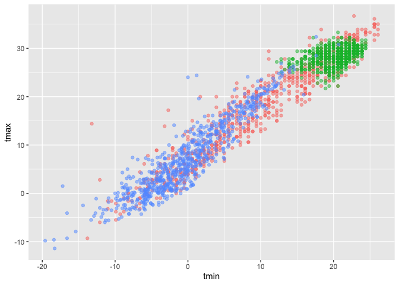
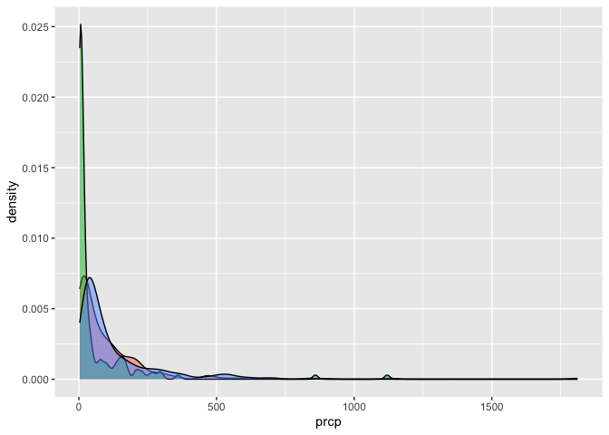
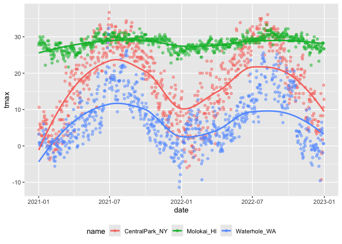
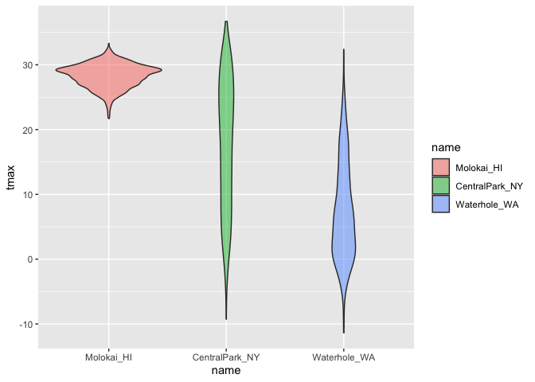
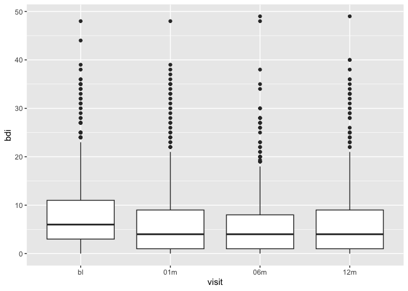

VIZ II
================
2025-10-07

Import the weather data

``` r
data("weather_df")
```

Let’s make our basic scatter plot

``` r
weather_df %>% 
  ggplot(aes(x=tmin,y=tmax))+
  geom_point(aes(color=name),alpha=0.5) +
  labs(
    x="Minimum daily temp",
    y="Maximum daily temp",
    title="Temperature scatterplot",
    caption="Data from NOAA",
    color="Location"
  )
```

    ## Warning: Removed 17 rows containing missing values or values outside the scale range
    ## (`geom_point()`).

<!-- -->

## Scales: tells the axis how to behave

``` r
ggp_temp=weather_df %>% 
  filter(tmax>10,tmax<30) %>% 
  ggplot(aes(x=tmin,y=tmax))+     #same thing as doing limits = c
  geom_point(aes(color=name),alpha=0.5) +
  labs(
    x="Minimum daily temp",
    y="Maximum daily temp",
    title="Temperature scatterplot",
    caption="Data from NOAA",
    color="Location"
  )+
  scale_x_continuous(
    breaks = c(-20,0,25),
    labels = c("-20C","0","25")
  )+
  scale_y_continuous(
    trans="sqrt",
    limits = c(10,30)
  )+
  viridis::scale_color_viridis(
    discrete=TRUE
  )
ggsave("weather_scatterplot.png",ggp_temp)
```

    ## Saving 7 x 5 in image

## Themes

Make my base plot.

``` r
ggp_temp+
  theme_minimal()+
  theme(legend.position="bottom")
```

<!-- -->

## Adding data in geoms

``` r
central_park_df=
  weather_df %>% 
  filter(name=="CentralPark_NY")

molokai_df=
  weather_df %>% 
  filter(name=="Molokai_HI")

ggplot(data=molokai_df,aes(x=date,y=tmax,color=name))+
  geom_point()+
  geom_line(data=central_park_df) #adding in another data set 
```

    ## Warning: Removed 1 row containing missing values or values outside the scale range
    ## (`geom_point()`).

<!-- -->

## `patchwork`

Making 3 fundamentally different plots and then stitching them together
using patchwork

``` r
ggp_tmax_tmin= 
  weather_df %>% 
  ggplot(aes(x=tmin,y=tmax,color=name))+
  geom_point(alpha=0.5)+
  theme(legend.position = "none")

ggp_prec_density=
  weather_df %>% 
  filter(prcp>0) %>% 
  ggplot(aes(x=prcp,fill=name))+
  geom_density(alpha=0.5)+
  theme(legend.position = "none")

ggp_temp_season=
  weather_df %>% 
  ggplot(aes(x=date,y=tmax,color=name))+
  geom_point(alpha=0.5)+
  geom_smooth(se=FALSE)+
  theme(legend.position = "bottom")
  
ggp_tmax_tmin
```

    ## Warning: Removed 17 rows containing missing values or values outside the scale range
    ## (`geom_point()`).

<!-- -->

``` r
ggp_prec_density
```

<!-- -->

``` r
ggp_temp_season
```

    ## `geom_smooth()` using method = 'loess' and formula = 'y ~ x'

    ## Warning: Removed 17 rows containing non-finite outside the scale range
    ## (`stat_smooth()`).
    ## Removed 17 rows containing missing values or values outside the scale range
    ## (`geom_point()`).

<!-- -->

``` r
(ggp_tmax_tmin+ggp_prec_density)/ggp_temp_season
```

    ## Warning: Removed 17 rows containing missing values or values outside the scale range
    ## (`geom_point()`).

    ## `geom_smooth()` using method = 'loess' and formula = 'y ~ x'

    ## Warning: Removed 17 rows containing non-finite outside the scale range
    ## (`stat_smooth()`).
    ## Removed 17 rows containing missing values or values outside the scale range
    ## (`geom_point()`).

<!-- -->

``` r
#multiple panels in the same figure ==> allows us to squeeze in important things about the data set without taking up too much space (good for papers)
```

## Data Manipulation

Let’s make temperature violin plots.

``` r
weather_df %>% 
  mutate(name=fct_relevel(name,c("Molokai_HI","CentralPark_NY","Waterhole_WA"))) %>% #Resetting the order 
  ggplot(aes(x=name,y=tmax,fill=name))+
  geom_violin(alpha=0.5)
```

    ## Warning: Removed 17 rows containing non-finite outside the scale range
    ## (`stat_ydensity()`).

<!-- -->

``` r
weather_df %>% 
  mutate(name=fct_reorder(name,tmax)) %>% 
  ggplot(aes(x=name,y=tmax,fill=name))+
  geom_violin(alpha=0.5)
```

    ## Warning: There was 1 warning in `mutate()`.
    ## ℹ In argument: `name = fct_reorder(name, tmax)`.
    ## Caused by warning:
    ## ! `fct_reorder()` removing 17 missing values.
    ## ℹ Use `.na_rm = TRUE` to silence this message.
    ## ℹ Use `.na_rm = FALSE` to preserve NAs.

    ## Warning: Removed 17 rows containing non-finite outside the scale range
    ## (`stat_ydensity()`).

<!-- -->

What about data tidiness?? x-axis: study visit y-axis:BDI score // make
into box plots

``` r
pulse_df=
  haven::read_sas("datasets/public_pulse_data.sas7bdat") %>% 
  janitor::clean_names() %>% 
  pivot_longer(
    bdi_score_bl:bdi_score_12m,
    names_to="visit",
    names_prefix="bdi_score_", #gets rid of prefix so axis is cleaner 
    values_to="bdi"
  ) %>% 
  mutate(visit=fct_inorder(visit)) #this solves the problem below

pulse_df %>% 
  ggplot(aes(x=visit,y=bdi))+
  geom_boxplot() #issue with this initial plot is that BL comes last due to alphabetical 
```

    ## Warning: Removed 879 rows containing non-finite outside the scale range
    ## (`stat_boxplot()`).

<!-- -->

\##Other materials

``` r
pup_data = 
  read_csv("datasets/FAS_pups.csv", na = c("NA", ".", ""), skip = 3) |>
  janitor::clean_names() |>
  mutate(
    sex = 
      case_match(
        sex, 
        1 ~ "male", 
        2 ~ "female")) # 1 codes to male and 2 codes to female 
```

    ## Rows: 313 Columns: 6
    ## ── Column specification ────────────────────────────────────────────────────────
    ## Delimiter: ","
    ## chr (1): Litter Number
    ## dbl (5): Sex, PD ears, PD eyes, PD pivot, PD walk
    ## 
    ## ℹ Use `spec()` to retrieve the full column specification for this data.
    ## ℹ Specify the column types or set `show_col_types = FALSE` to quiet this message.

``` r
litter_data = 
  read_csv("datasets/FAS_litters.csv", na = c("NA", ".", "")) |>
  janitor::clean_names() |>
  separate(group, into = c("dose", "day_of_tx"), sep = 3) #this column group contains multiple things: dose and day of so we want to separate it CON7 --> CON and 7 are separated now 
```

    ## Rows: 49 Columns: 8
    ## ── Column specification ────────────────────────────────────────────────────────
    ## Delimiter: ","
    ## chr (2): Group, Litter Number
    ## dbl (6): GD0 weight, GD18 weight, GD of Birth, Pups born alive, Pups dead @ ...
    ## 
    ## ℹ Use `spec()` to retrieve the full column specification for this data.
    ## ℹ Specify the column types or set `show_col_types = FALSE` to quiet this message.

``` r
fas_data = left_join(pup_data, litter_data, by = "litter_number") 

fas_data |> 
  select(sex, dose, day_of_tx, pd_ears:pd_walk) |> 
  pivot_longer(
    pd_ears:pd_walk,
    names_to = "outcome", 
    names_prefix="pd_",
    values_to = "pn_day") |> 
  drop_na() |> 
  mutate(outcome = forcats::fct_reorder(outcome, pn_day, median)) |> 
  ggplot(aes(x = dose, y = pn_day)) + 
  geom_violin() + 
  facet_grid(day_of_tx ~ outcome) #day_of_tx defines the rows at each level and outcome defines the columns 
```

<!-- -->
