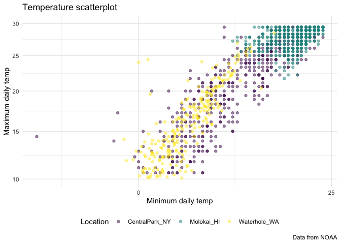
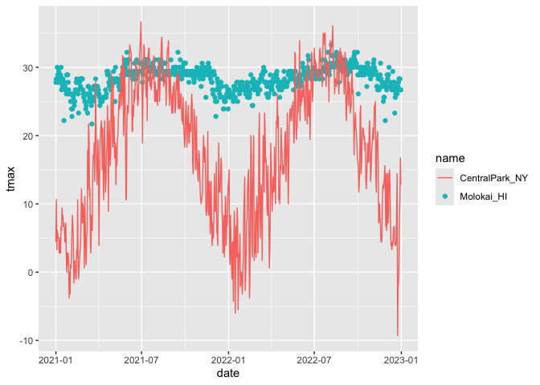

VIZ II
================
2025-10-07

Import the weather data

``` r
data("weather_df")
```

Let’s make our basic scatter plot

``` r
weather_df %>% 
  ggplot(aes(x=tmin,y=tmax))+
  geom_point(aes(color=name),alpha=0.5) +
  labs(
    x="Minimum daily temp",
    y="Maximum daily temp",
    title="Temperature scatterplot",
    caption="Data from NOAA",
    color="Location"
  )
```

    ## Warning: Removed 17 rows containing missing values or values outside the scale range
    ## (`geom_point()`).

<!-- -->

## Scales: tells the axis how to behave

``` r
ggp_temp=weather_df %>% 
  filter(tmax>10,tmax<30) %>% 
  ggplot(aes(x=tmin,y=tmax))+     #same thing as doing limits = c
  geom_point(aes(color=name),alpha=0.5) +
  labs(
    x="Minimum daily temp",
    y="Maximum daily temp",
    title="Temperature scatterplot",
    caption="Data from NOAA",
    color="Location"
  )+
  scale_x_continuous(
    breaks = c(-20,0,25),
    labels = c("-20C","0","25")
  )+
  scale_y_continuous(
    trans="sqrt",
    limits = c(10,30)
  )+
  viridis::scale_color_viridis(
    discrete=TRUE
  )
ggsave("weather_scatterplot.png",ggp_temp)
```

    ## Saving 7 x 5 in image

## Themes

Make my base plot.

``` r
ggp_temp+
  theme_minimal()+
  theme(legend.position="bottom")
```

<!-- -->

## Adding data in geoms

``` r
central_park_df=
  weather_df %>% 
  filter(name=="CentralPark_NY")

molokai_df=
  weather_df %>% 
  filter(name=="Molokai_HI")

ggplot(data=molokai_df,aes(x=date,y=tmax,color=name))+
  geom_point()+
  geom_line(data=central_park_df) #adding in another data set 
```

    ## Warning: Removed 1 row containing missing values or values outside the scale range
    ## (`geom_point()`).

<!-- -->
