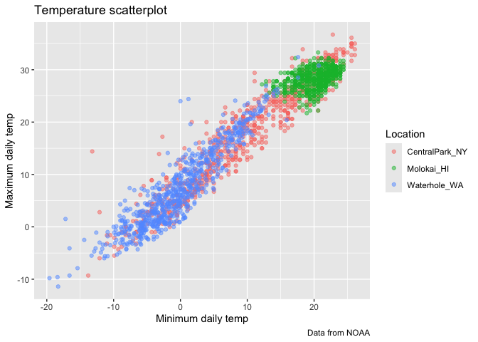

VIZ II
================
2025-10-07

Import the weather data

``` r
data("weather_df")
```

Let’s make our basic scatter plot

``` r
weather_df %>% 
  ggplot(aes(x=tmin,y=tmax))+
  geom_point(aes(color=name),alpha=0.5) +
  labs(
    x="Minimum daily temp",
    y="Maximum daily temp",
    title="Temperature scatterplot",
    caption="Data from NOAA",
    color="Location"
  )
```

    ## Warning: Removed 17 rows containing missing values or values outside the scale range
    ## (`geom_point()`).

<!-- -->

## Scales: tells the axis how to behave

``` r
weather_df %>% 
  filter(tmax>10,tmax<30) %>% 
  ggplot(aes(x=tmin,y=tmax))+     #same thing as doing limits = c
  geom_point(aes(color=name),alpha=0.5) +
  labs(
    x="Minimum daily temp",
    y="Maximum daily temp",
    title="Temperature scatterplot",
    caption="Data from NOAA",
    color="Location"
  )+
  scale_x_continuous(
    breaks = c(-20,0,25),
    labels = c("-20C","0","25")
  )+
  scale_y_continuous(
    trans="sqrt",
    limits = c(10,30)
  )+
  viridis::scale_color_viridis(
    discrete=TRUE
  )
```

<!-- -->
